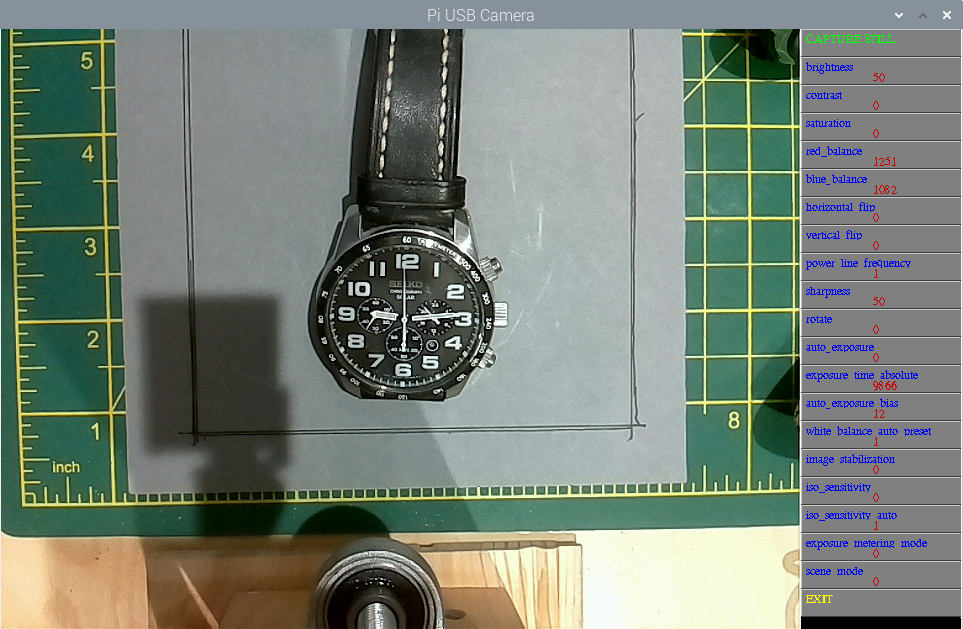

# PiUSBCamera

Script to allow control of a USB Camera on a Pi, using v4l2-ctl, to allow parameters to be set and still pictures or videos to be taken. 

Shows a reduced preview but saves stills / video at a user set resolutions.

Click mouse on the left of a button to decrease, right to increase

Should detect the USB camera, or a pi camera, and set the appropriate control buttons.

Requires opencv installed sudo apt-get install python3-opencv

## Screenshot

