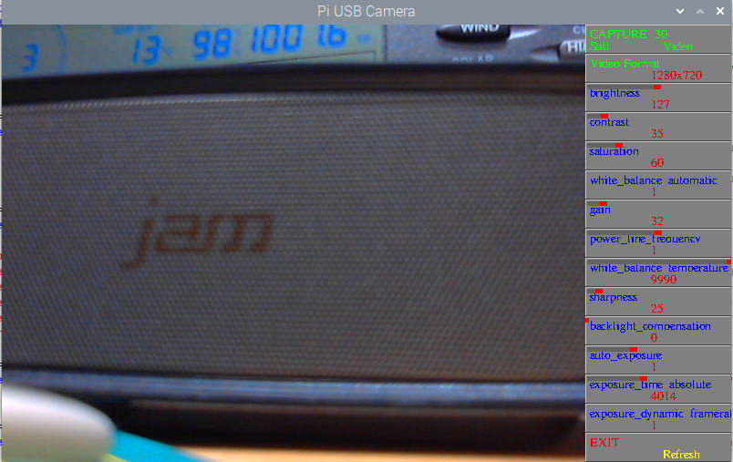

# PiUSBCamera

Script to allow control of a USB Camera on a Pi, using v4l2-ctl, to allow parameters to be set and still pictures or videos to be taken. 

Shows a reduced preview but saves stills / video at max resolutions or user set.

Click mouse on the left of a button to decrease, right to increase

Click on image to restore camera default settings

Should detect the USB camera, or a pi camera, and set the appropriate control buttons.

Requires opencv installed, use  sudo apt-get install python3-opencv

To get it to work under Bullseye try...

sudo apt install libsdl2-ttf-2.0-0

and

python3 -m pip3 install -U pygame --user

## Screenshot

